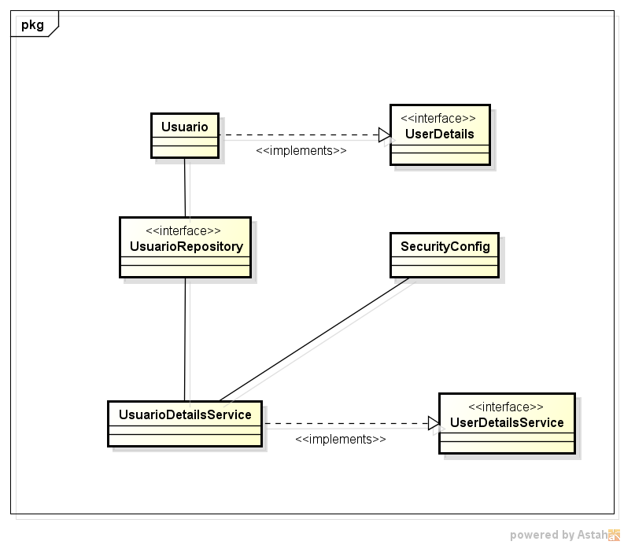

## UserDetails: A Alma da Autenticação no Spring Security

No Spring Security, a interface `UserDetails` assume um papel crucial na autenticação do usuário. Ela define um contrato para fornecer detalhes essenciais sobre um usuário, permitindo que o framework tome decisões de autorização e gerencie o estado de autenticação.

**Estrutura Essencial:**

A interface `UserDetails` exige a implementação de cinco métodos:

1. **getUsername():** Retorna o nome de usuário do usuário.

2. **getPassword():** Retorna a senha do usuário (geralmente criptografada).

3. **getAuthorities():** Retorna uma coleção de objetos `GrantedAuthority` que representam as autoridades do usuário.

4. **isAccountNonExpired():** Indica se a conta do usuário está ativa e não expirada.

5. **isCredentialsNonExpired():** Indica se as credenciais do usuário (senha) estão válidas e não expiradas.

6. **isEnabled():** Indica se o usuário está habilitado para acessar o sistema.

**Métodos Adicionais:**

Além dos métodos obrigatórios, a interface `UserDetails` define métodos opcionais que podem ser utilizados para fornecer informações adicionais sobre o usuário:

1. **getAccountNonLocked():** Indica se a conta do usuário está bloqueada.

2. **getPasswordResetDate():** Retorna a data em que a senha do usuário foi redefinida pela última vez.

3. **getLastLoginDate():** Retorna a data do último login do usuário.

**Implementação:**

A implementação da interface `UserDetails` é tipicamente realizada por uma classe personalizada que representa um usuário. Essa classe pode recuperar dados de um banco de dados, um serviço de diretório ou qualquer outra fonte de autenticação.

**Integração com o Spring Security:**

O Spring Security utiliza a implementação do `UserDetails` para:

* Validar credenciais de login (nome de usuário e senha).
* Gerar tokens de autenticação.
* Verificar as autoridades do usuário para controlar o acesso a recursos.
* Gerenciar o estado de autenticação do usuário durante a sessão.

**Benefícios:**

O uso da interface `UserDetails` oferece diversos benefícios:

* **Padronização:** Permite uma interface consistente para representar detalhes do usuário em diferentes fontes de autenticação.
* **Flexibilidade:** Suporta a integração com diversas fontes de autenticação, como bancos de dados, LDAP e serviços de autenticação personalizados.
* **Segurança:** Facilita a implementação de medidas de segurança, como bloqueio de conta e expiração de senha.
* **Reutilização:** Permite a reutilização de código de autenticação em diferentes partes da aplicação.

**Conclusão:**

A interface `UserDetails` é um componente fundamental do Spring Security, fornecendo uma base robusta e flexível para a autenticação do usuário. Sua implementação adequada garante a segurança e confiabilidade do acesso ao sistema, além de facilitar o desenvolvimento e a manutenção da aplicação.

# Classe Usuario

A classe `Usuario` representa um usuário do sistema e implementa a interface `UserDetails` para integração com o Spring Security. Vamos dissecar as anotações e seus significados:

```java
package com.apirest.springsecuritydemo1.entities;

import java.util.ArrayList;
import java.util.Collection;
import java.util.List;

import org.springframework.security.core.GrantedAuthority;
import org.springframework.security.core.authority.SimpleGrantedAuthority;
import org.springframework.security.core.userdetails.UserDetails;

import jakarta.persistence.CascadeType;
import jakarta.persistence.Entity;
import jakarta.persistence.FetchType;
import jakarta.persistence.GeneratedValue;
import jakarta.persistence.GenerationType;
import jakarta.persistence.Id;
import jakarta.persistence.OneToMany;
import lombok.AllArgsConstructor;
import lombok.Builder;
import lombok.EqualsAndHashCode;
import lombok.Getter;
import lombok.NoArgsConstructor;
import lombok.Setter;
import lombok.ToString;

@Entity
@Getter
@Setter
@AllArgsConstructor
@NoArgsConstructor
@EqualsAndHashCode(of = "id")
@Builder
@ToString
public class Usuario implements UserDetails{

    @Id
    @GeneratedValue(strategy = GenerationType.AUTO)
    private Long id;

    private String login;
    private String senha;
    private String nome;

    // Um usuário têm muitos telefones
    @OneToMany(mappedBy = "usuario", orphanRemoval = true, cascade = CascadeType.ALL, fetch = FetchType.LAZY)
    private List<Telefone> telefones = new ArrayList<>();

    private String role;


    // Add métodos do UserDetails
    /* Retorna as autorizações concedidas ao usuário. */
    @Override
    public Collection<? extends GrantedAuthority> getAuthorities() {
        return List.of(new SimpleGrantedAuthority(role));
    }

    /* Retorna a senha usada para autenticar o usuário. */
    @Override
    public String getPassword() {
        return senha;
    }

    /* Retorna o nome de usuário usado para autenticar o usuário. */
    @Override
    public String getUsername() {
        return login;
    }

    /* Indica se a conta do usuário expirou. */
    @Override
    public boolean isAccountNonExpired() {
        return true;
    }

    @Override
    public boolean isAccountNonLocked() {
        return true;
    }

    @Override
    public boolean isCredentialsNonExpired() {
        return true;
    }

    @Override
    public boolean isEnabled() {
        return true;
    }

}
```

**Anotações Lombok:**

* `@Entity`: Indica que essa classe é uma entidade JPA e pode ser persistida em um banco de dados relacional.
* `@Getter`: Gera automaticamente métodos getters para todos os atributos privados.
* `@Setter`: Gera automaticamente métodos setters para todos os atributos privados (exceto `id` devido a `@NoArgsConstructor`).
* `@AllArgsConstructor`: Gera um construtor com todos os atributos como parâmetros.
* `@NoArgsConstructor`: Gera um construtor sem argumentos.
* `@EqualsAndHashCode(of = "id")`: Define como objetos dessa classe serão comparados (pelo atributo `id`) e calcula o hashcode.
* `@Builder`: Permite a criação de objetos de forma fluente usando o padrão builder.
* `@ToString`: Gera automaticamente o método `toString()` para imprimir informações do objeto.

**Atributos:**

* `id`: Identificador único do usuário (gerado automaticamente).
* `login`: Nome de login do usuário.
* `senha`: Senha do usuário (armazenada de forma segura, possivelmente criptografada).
* `nome`: Nome completo do usuário.
* `telefones`: Lista de telefones associados ao usuário (relacionamento `@OneToMany`).
* `role`: Papel do usuário dentro do sistema (define as permissões).

**Implementação de UserDetails:**

A classe `Usuario` implementa os métodos da interface `UserDetails`:

* `getAuthorities()`: Retorna uma coleção com a autoridade do usuário baseado no atributo `role`.
* `getPassword()`: Retorna a senha do usuário.
* `getUsername()`: Retorna o login do usuário.
* `isAccountNonExpired()`, `isAccountNonLocked()`, `isCredentialsNonExpired()`, `isEnabled()`: Sempre retornam `true` (vale ressaltar que pode customizar a lógica se necessário).

**Relacionamento:**

* `@OneToMany`: Define um relacionamento um-para-muitos entre `Usuario` e `Telefone`. Um usuário pode ter vários telefones.
* `mappedBy = "usuario"`: Indica que a entidade `Telefone` possui um atributo `usuario` que referencia a entidade `Usuario`.
* `orphanRemoval = true`: Se um usuário for excluído, seus telefones associados também serão excluídos.
* `cascade = CascadeType.ALL`: Alterações realizadas no usuário (como exclusão) serão propagadas para os telefones associados.
* `fetch = FetchType.LAZY`: Telefones associados ao usuário serão carregados somente quando necessário (otimização de performance).

**Resumo:**

A classe `Usuario` representa um modelo completo para a entidade de usuário no sistema. Ela aproveita as anotações Lombok para reduzir código boilerplate e implementa a interface `UserDetails` para integração com o Spring Security. A relação um-para-muitos com `Telefone` permite associar vários telefones a um único usuário.

# Interface UsuarioRepository

A interface `UsuarioRepository` é o cerne da persistência de dados de usuários no sistema. Ela estende a interface `JpaRepository` do Spring Data JPA, herdando todos os seus métodos CRUD (Create, Read, Update, Delete) para manipular objetos do tipo `Usuario` no banco de dados relacional.

```java
package com.apirest.springsecuritydemo1.repositories;

import java.util.Optional;

import org.springframework.data.jpa.repository.JpaRepository;
import org.springframework.data.jpa.repository.Query;
import org.springframework.stereotype.Repository;

import com.apirest.springsecuritydemo1.entities.Usuario;

@Repository
public interface UsuarioRepository extends JpaRepository<Usuario, Long> {

    @Query("SELECT u FROM Usuario u WHERE u.login = ?1")
    Optional<Usuario> findUserByLogin(String login);
}
```

**Anotação @Repository:**

* Indica que essa interface é um repositório de dados do Spring. O Spring irá gerenciar o ciclo de vida desse bean e disponibilizá-lo para injeção de dependência em outras classes.

**Extends JpaRepository<Usuario, Long>:**

* O `JpaRepository` é uma interface genérica fornecida pelo Spring Data JPA. Ela define métodos CRUD prontos para uso, como `save`, `findById`, `deleteById`, etc.
* Os parâmetros genéricos `<Usuario, Long>` indicam que o repositório gerencia entidades do tipo `Usuario` e o identificador primário delas é do tipo `Long`.

**Método findUserByLogin(String login):**

* Este método é um exemplo de consulta personalizada usando a anotação `@Query`.
* Ele define uma consulta JPQL (Java Persistence Query Language) para buscar um usuário pelo login.
* O parâmetro `?1` é um placeholder para o login do usuário que será fornecido no momento da chamada do método.
* O método retorna um `Optional<Usuario>`, indicando que a busca pode ou não encontrar um usuário.

**Benefícios da Extensão JpaRepository:**

* Evita a escrita manual de código SQL para operações CRUD básicas.
* Simplifica o acesso e manipulação de dados do usuário.
* Melhora a legibilidade e manutenção do código.

**Consultas Personalizadas:**

* A anotação `@Query` permite a criação de consultas JPQL personalizadas para buscar dados de forma mais específica.
* Isso possibilita a criação de métodos de busca com base em diferentes critérios, como nome, e-mail, etc.

**Recapitulando:**

A interface `UsuarioRepository` é o elo entre a aplicação e o banco de dados para persistir e recuperar dados de usuários. Ela se apoia no Spring Data JPA para simplificar o acesso a dados e possibilita a criação de consultas personalizadas para atender às necessidades específicas do sistema.


# UserDetailsService: A Porta de Entrada para a Autenticação no Spring Security

No Spring Security, a interface `UserDetailsService` assume um papel crucial na autenticação do usuário. Ela define um contrato para fornecer detalhes essenciais sobre um usuário, permitindo que o framework tome decisões de autorização e gerencie o estado de autenticação.

**Estrutura Fundamental:**

A interface `UserDetailsService` exige a implementação de um único método:

1. **loadUserByUsername(String username):** Recebe o nome de usuário como parâmetro e retorna um objeto `UserDetails` que representa o usuário com suas informações de autenticação.

**Implementação:**

A implementação da interface `UserDetailsService` é tipicamente realizada por uma classe personalizada que recupera os dados do usuário de uma fonte de autenticação, como banco de dados, LDAP ou serviço de autenticação externo. A classe implementada deve:

* Buscar o usuário com base no nome de usuário fornecido.
* Criar e retornar um objeto `UserDetails` com as informações do usuário, incluindo nome de usuário, senha, autoridades e outras informações relevantes.
* Lançar exceções apropriadas caso o usuário não seja encontrado ou haja algum problema com a autenticação.

**Integração com o Spring Security:**

O Spring Security utiliza a implementação do `UserDetailsService` para:

* Validar credenciais de login (nome de usuário e senha).
* Gerar tokens de autenticação.
* Verificar as autoridades do usuário para controlar o acesso a recursos.
* Gerenciar o estado de autenticação do usuário durante a sessão.

**Configuração:**

Para configurar o `UserDetailsService` no Spring Security, é necessário indicar a classe de implementação no arquivo de configuração de segurança. Isso pode ser feito usando a propriedade `userDetailsService` na classe `AuthenticationProvider`.

**Benefícios:**

O uso da interface `UserDetailsService` oferece diversos benefícios:

* **Padronização:** Permite uma interface consistente para representar detalhes do usuário em diferentes fontes de autenticação.
* **Flexibilidade:** Suporta a integração com diversas fontes de autenticação, como bancos de dados, LDAP e serviços de autenticação personalizados.
* **Segurança:** Facilita a implementação de medidas de segurança, como bloqueio de conta e expiração de senha.
* **Reutilização:** Permite a reutilização de código de autenticação em diferentes partes da aplicação.

**Exemplo simples de Implementação:**

```java
@Service
public class UserDetailsServiceImpl implements UserDetailsService {

    @Autowired
    private UsuarioRepository usuarioRepository;

    @Override
    public UserDetails loadUserByUsername(String username) {
        Usuario usuario = usuarioRepository.findByLogin(username);

        if (usuario == null) {
            throw new UsernameNotFoundException("Usuário não encontrado: " + username);
        }

        return new User(usuario.getLogin(), usuario.getSenha(), usuario.getAuthorities());
    }
}
```

**Conclusão:**

A interface `UserDetailsService` é um componente fundamental do Spring Security, fornecendo uma base robusta e flexível para a autenticação do usuário. Sua implementação adequada garante a segurança e confiabilidade do acesso ao sistema, além de facilitar o desenvolvimento e a manutenção da aplicação.


# Classe UsuarioDetailsService

A classe `UsuarioDetailsService` desempenha um papel vital no Spring Security, pois é responsável por fornecer os detalhes de autenticação do usuário. 

```java
package com.apirest.springsecuritydemo1.service;

import org.springframework.beans.factory.annotation.Autowired;
import org.springframework.security.core.userdetails.UserDetails;
import org.springframework.security.core.userdetails.UserDetailsService;
import org.springframework.security.core.userdetails.UsernameNotFoundException;
import org.springframework.stereotype.Service;

import com.apirest.springsecuritydemo1.repositories.UsuarioRepository;

@Service
public class UsuarioDetailsService implements UserDetailsService {

    @Autowired
    private UsuarioRepository usuarioRepository;

    @Override
    public UserDetails loadUserByUsername(String username) throws UsernameNotFoundException {
        return usuarioRepository.findUserByLogin(username)
                .orElseThrow(() -> new RuntimeException("Usuário não encontrado: " + username));
    }
}
```

**Anotação @Service:**

* Esta anotação marca a classe como um componente de serviço do Spring. O Spring gerenciará o ciclo de vida dessa classe e a tornará disponível para injeção de dependência em outras classes.

**Implementa UserDetailsService:**

* A classe implementa a interface `UserDetailsService`. Isso a obriga a implementar o método `loadUserByUsername`.

**Atributo usuarioRepository:**

* Este atributo, privado e final (provavelmente devido ao uso do Lombok `@Autowired`), armazena uma instância da interface `UsuarioRepository`.
* Injetada pelo construtor, a dependência do repositório de usuários permite a `UsuarioDetailsService` buscar informações do usuário no banco de dados.

**Método loadUserByUsername(String username):**

* Este é o método principal da classe, implementado da interface `UserDetailsService`.
* Ele recebe o nome de usuário (`username`) como argumento.
* Utiliza o repositório de usuários (`usuarioRepository`) para buscar um usuário com o login fornecido através do método `findUserByLogin(username)`.
* O método `findUserByLogin` retorna um `Optional<Usuario>`, que pode conter um objeto `Usuario` ou estar vazio caso o usuário não seja encontrado.
* O método `orElseThrow` do `Optional` é utilizado para tratar o caso em que o usuário não é encontrado.
* Se o usuário não for encontrado, a `UsuarioDetailsService` lança uma exceção `RuntimeException` com uma mensagem informativa.
* Se o usuário for encontrado, ele é convertido em um objeto `UserDetails` e retornado.

**Resumo:**

A classe `UsuarioDetailsService` atua como um maestro da autenticação. Ela delega a busca de informações do usuário ao repositório (`UsuarioRepository`) e retorna os detalhes necessários (`UserDetails`) para o Spring Security validar credenciais e gerenciar o estado de autenticação do usuário. A detecção e tratamento de usuários não encontrados garante a robustez do processo de autenticação.


# Classe SecurityConfig

A classe `SecurityConfig` assume um papel crucial na configuração da segurança da aplicação web, protegendo os recursos contra acessos não autorizados. 

```java
package com.apirest.springsecuritydemo1.security;

import org.springframework.context.annotation.Bean;
import org.springframework.context.annotation.Configuration;
import org.springframework.security.authentication.AuthenticationProvider;
import org.springframework.security.authentication.dao.DaoAuthenticationProvider;
import org.springframework.security.config.annotation.method.configuration.EnableMethodSecurity;
import org.springframework.security.config.annotation.web.builders.HttpSecurity;
import org.springframework.security.config.annotation.web.configuration.EnableWebSecurity;
import org.springframework.security.config.annotation.web.configurers.AbstractHttpConfigurer;
import org.springframework.security.core.userdetails.UserDetailsService;
import org.springframework.security.crypto.bcrypt.BCryptPasswordEncoder;
import org.springframework.security.crypto.password.PasswordEncoder;
import org.springframework.security.web.SecurityFilterChain;

import com.apirest.springsecuritydemo1.service.UsuarioDetailsService;

import static org.springframework.security.config.Customizer.withDefaults;

@Configuration
@EnableWebSecurity
@EnableMethodSecurity
public class SecurityConfig {

    @Bean
    public SecurityFilterChain securityFilterChain(HttpSecurity http) throws Exception {
        
        http.authorizeHttpRequests(auth -> auth                                                        
                        .requestMatchers("/usuario/", "/usuario/create", "/usuario/{id}").permitAll()    
                        .anyRequest().authenticated())                                                 
                .httpBasic(withDefaults())                                                            
                .formLogin(withDefaults())                                                             
                .csrf(AbstractHttpConfigurer::disable);                                                
        
        return http.build();                                                                          

    }

    
    /* É um serviço de detalhes do usuário que é responsável por carregar as informações do usuário 
    a partir de um repositório de dados, como um banco de dados.*/ 
    @Bean
    public UserDetailsService userDetailsService() {
        return new UsuarioDetailsService();
    }


    /*Método de fábrica que cria e configura um provedor de autenticação do tipo DaoAuthenticationProvider. 
    Ele é retornado como um objeto de bean. Esse bean será automaticamente injetado em outros componentes do Spring Security 
    que precisam de um provedor de autenticação para processar as solicitações de autenticação.*/
    @Bean
    public AuthenticationProvider authenticationProvider() {
        DaoAuthenticationProvider daoAuthenticationProvider = new DaoAuthenticationProvider();
        daoAuthenticationProvider.setUserDetailsService(userDetailsService());
        daoAuthenticationProvider.setPasswordEncoder(passwordEncoder());
        return daoAuthenticationProvider;

    }


    /* passwordEncoder() é um codificador de senha que é responsável por codificar a senha 
    fornecida pelo usuário durante o processo de autenticação.*/
    @Bean
    public PasswordEncoder passwordEncoder() {
        return new BCryptPasswordEncoder();
    }
    
}

```

**Anotações:**

* `@Configuration`: Marca a classe como uma configuração do Spring.
* `@EnableWebSecurity`: Habilita a configuração de segurança do Spring Security.
* `@EnableMethodSecurity`: Habilita a segurança baseada em métodos, permitindo o controle de acesso a métodos específicos das classes da aplicação.

**Método securityFilterChain(HttpSecurity http) throws Exception:**

* Este método é o coração da configuração de segurança. Ele recebe um objeto `HttpSecurity` e configura as diversas camadas de segurança da aplicação:

    * **authorizeHttpRequests(auth -> auth):** Define as regras de autorização para as solicitações HTTP:
        * `permitAll()`: Permite o acesso sem autenticação para as URLs especificadas (por exemplo, "/usuario/", "/usuario/create", "/usuario/{id}").
        * `anyRequest().authenticated()`: Exige autenticação para todas as outras solicitações.
    * **httpBasic(withDefaults())**: Define a autenticação básica como o método de autenticação padrão, permitindo que os usuários se autentiquem usando um nome de usuário e senha.
    * **formLogin(withDefaults())**: Define o login via formulário como um método de autenticação alternativo, permitindo que os usuários se autentiquem através de um formulário HTML.
    * `csrf(AbstractHttpConfigurer::disable)`: Desabilita a proteção contra ataques CSRF (Cross-Site Request Forgery). **Cuidado! Desabilitar o CSRF pode aumentar a vulnerabilidade da aplicação.**

**Método userDetailsService():**

* Este método cria e retorna uma instância da classe `UsuarioDetailsService`, que é responsável por carregar as informações do usuário a partir de um repositório de dados (como um banco de dados).

**Método authenticationProvider():**

* Este método cria e configura um provedor de autenticação do tipo `DaoAuthenticationProvider`. O `DaoAuthenticationProvider` utiliza o `UserDetailsService` para buscar o usuário no banco de dados e compara a senha fornecida pelo usuário com a senha armazenada no banco de dados.

**Método passwordEncoder():**

* Este método cria e retorna um codificador de senha do tipo `BCryptPasswordEncoder`. O `BCryptPasswordEncoder` é responsável por codificar a senha fornecida pelo usuário de forma segura antes de compará-la com a senha armazenada no banco de dados.

**Resumo:**

A classe `SecurityConfig` define as configurações de segurança da aplicação web, incluindo:

* Regras de autorização para determinar quem pode acessar quais recursos.
* Métodos de autenticação para permitir que os usuários se autentiquem na aplicação.
* Codificação de senha para proteger as senhas dos usuários contra ataques.

Ao configurar a segurança de forma adequada, você garante que sua aplicação web esteja protegida contra acessos não autorizados e outros tipos de ataques.


## Classe IndexController

A classe `IndexController` assume o papel crucial de gerenciar os recursos da API REST relacionados aos usuários do sistema. 

```java
package com.apirest.springsecuritydemo1.controllers;

import java.util.List;

import org.springframework.beans.factory.annotation.Autowired;
import org.springframework.http.HttpStatus;
import org.springframework.http.ResponseEntity;
import org.springframework.security.access.AccessDeniedException;
import org.springframework.security.access.prepost.PreAuthorize;
import org.springframework.security.core.Authentication;
import org.springframework.security.core.context.SecurityContextHolder;
import org.springframework.security.core.userdetails.UserDetails;
import org.springframework.security.crypto.password.PasswordEncoder;
import org.springframework.web.bind.annotation.DeleteMapping;
import org.springframework.web.bind.annotation.GetMapping;
import org.springframework.web.bind.annotation.PathVariable;
import org.springframework.web.bind.annotation.PostMapping;
import org.springframework.web.bind.annotation.PutMapping;
import org.springframework.web.bind.annotation.RequestBody;
import org.springframework.web.bind.annotation.RequestMapping;
import org.springframework.web.bind.annotation.RequestParam;
import org.springframework.web.bind.annotation.RestController;

import com.apirest.springsecuritydemo1.entities.Usuario;
import com.apirest.springsecuritydemo1.repositories.UsuarioRepository;

@RestController
@RequestMapping("/usuario")
public class IndexController {

    @Autowired
    private UsuarioRepository usuarioRepository;

    @Autowired
    private PasswordEncoder passwordEncoder;

    // http://localhost:8080/projeto-api-rest/usuario/
    @GetMapping("/")
    public ResponseEntity<String> getPaginaPrincipal(){
        return new ResponseEntity("Página Principal", HttpStatus.OK);
    }

    // http://localhost:8080/projeto-api-rest/usuario/{id}
    @GetMapping(value = "/{id}", produces = "application/json")
    public ResponseEntity getByIdUsuario(@PathVariable("id") Long id) {
        return new ResponseEntity(usuarioRepository.findById(id), HttpStatus.OK);
    }

    // http://localhost:8080/projeto-api-rest/usuario/admin/{loginAdmin}/all
    @GetMapping(value = "/admin/{loginAdmin}/all", produces = "application/json")
    @PreAuthorize("hasAuthority('ADMIN') or hasAuthority('USER')")
    public ResponseEntity<List<Usuario>> getAllUsuarios(@PathVariable("loginAdmin") String loginAdmin) {

        Usuario usuarioLogin = usuarioRepository.findUserByLogin(loginAdmin)
                .orElseThrow(() -> new RuntimeException("Login: " + loginAdmin + " não encontrado"));

        // Obter usuário autenticado
        UserDetails usuarioRegistrado = obterDetalhesUsuarioLogin();

        // Verifica se o usuário autenticado é o mesmo que está sendo atualizado
        if(!usuarioLogin.getLogin().equals(usuarioRegistrado.getUsername())){
            throw new AccessDeniedException("Você não tem permissão para atualizar este usuário.");
        }

        return new ResponseEntity<List<Usuario>>(usuarioRepository.findAll(), HttpStatus.OK);
    }

    // http://localhost:8080/projeto-api-rest/usuario/create
    @PostMapping(value = "/create", produces = "application/json")
    public ResponseEntity<Usuario> createUsuario(@RequestBody Usuario usuario) {

        usuario.setSenha(passwordEncoder.encode(usuario.getSenha()));

        // Associa o cadastro do telefone ao usuário
        for(int pos=0; pos<usuario.getTelefones().size(); pos++){
            usuario.getTelefones().get(pos).setUsuario(usuario);
        }

        return new ResponseEntity<Usuario>(usuarioRepository.save(usuario), HttpStatus.CREATED);
    }

    // http://localhost:8080/projeto-api-rest/usuario/replace/admin/{loginAdmin}
    @PutMapping(value = "/replace/admin/{loginAdmin}", produces = "application/json")
    @PreAuthorize("hasAuthority('ADMIN')")
    public ResponseEntity<Usuario> updateUsuario(@PathVariable("loginAdmin") String loginAdmin, @RequestBody Usuario updateUsuario) {
        Usuario usuarioLogin = usuarioRepository.findUserByLogin(loginAdmin)
                .orElseThrow(() -> new RuntimeException("Login: " + loginAdmin + " não encontrado"));

        // Obter usuário autenticado
        UserDetails usuarioRegistrado = obterDetalhesUsuarioLogin();

        // Verifica se o usuário autenticado é o mesmo que está sendo atualizado
        if(!usuarioLogin.getLogin().equals(usuarioRegistrado.getUsername())){
            throw new AccessDeniedException("Você não tem permissão para atualizar este usuário.");
        }

        Usuario newUsuario = new Usuario();
        newUsuario.setId(updateUsuario.getId());
        newUsuario.setLogin(updateUsuario.getLogin());
        newUsuario.setSenha(updateUsuario.getSenha());
        newUsuario.setNome(updateUsuario.getNome());
        newUsuario.setTelefones(updateUsuario.getTelefones());
        newUsuario.setRole(updateUsuario.getRole());

        // Atualiza a senha apenas se uma nova senha foi fornecida
        if (updateUsuario.getSenha() != null && !updateUsuario.getSenha().isEmpty()) {
            newUsuario.setSenha(passwordEncoder.encode(updateUsuario.getSenha()));
        }

        // Associa o cadastro do telefone ao usuário
        for(int pos=0; pos<updateUsuario.getTelefones().size(); pos++){
            updateUsuario.getTelefones().get(pos).setUsuario(updateUsuario);
        }

        return new ResponseEntity<Usuario>(usuarioRepository.save(newUsuario), HttpStatus.OK);
    }

    // http://localhost:8080/projeto-api-rest/usuario/admin/{loginAdmin}/deletar/{idDeletar}
    @DeleteMapping(value = "/admin/{loginAdmin}/deletar/{idDeletar}", produces = "application/json")
    @PreAuthorize("hasAuthority('ADMIN')")
    public ResponseEntity<Usuario> deleteUsuario(@PathVariable("loginAdmin") String loginAdmin, @PathVariable("idDeletar") Long idDeletar) {


        Usuario usuarioLogin = usuarioRepository.findUserByLogin(loginAdmin)
                .orElseThrow(() -> new RuntimeException("Login: " + loginAdmin + " não encontrado"));

        // Obter usuário autenticado
        UserDetails usuarioRegistrado = obterDetalhesUsuarioLogin();

        // Verifica se o usuário autenticado é o mesmo que está sendo atualizado
        if(!usuarioLogin.getLogin().equals(usuarioRegistrado.getUsername())){
            throw new AccessDeniedException("Você não tem permissão para atualizar este usuário.");
        }

        Usuario deletarUsuario = usuarioRepository.findById(idDeletar)
                .orElseThrow(() -> new RuntimeException("id: " + idDeletar + " não encontrado"));

        usuarioRepository.delete(deletarUsuario);
        return ResponseEntity.noContent().build();
    }

    // http://localhost:8080/projeto-api-rest/usuario/teste?nome=Daniel&sobrenome=Penelva
    @GetMapping(value = "/teste", produces = "application/json")
    public ResponseEntity seuNomeCompleto(
            @RequestParam(value = "nome", defaultValue = "nome não declarado") String nome,
            @RequestParam(value = "sobrenome", required = true, defaultValue = "sobrenome não informado") String sobrenome) {
        System.out.println("Nome: " + nome + " - Sobrenome: " + sobrenome);
        return new ResponseEntity("Nome: " + nome + " - Sobrenome: " + sobrenome, HttpStatus.OK);
    }


    /*Método usado para obter as informações do usuário atualmente autenticado em uma aplicação Spring Security.
     * Ou seja ele obtêm as informações do usuário autenticado. */
    public UserDetails obterDetalhesUsuarioLogin(){
        Authentication authentication = SecurityContextHolder.getContext().getAuthentication();  
        if (authentication != null && authentication.getPrincipal() instanceof UserDetails) {    
            return (UserDetails) authentication.getPrincipal();                                  
        }
        return null;
    }
}
```

**Anotações:**

* `@RestController`: Indica que essa classe é um controlador REST e que seus métodos retornam valores JSON automaticamente.
* `@RequestMapping("/usuario")`: Define o caminho base para todos os endpoints da API REST relacionados aos usuários.

**Métodos:**

* **getPaginaPrincipal():**
    * Retorna uma mensagem de boas-vindas na página principal da API.
    * Mapeia para o endpoint `GET /usuario/`.
    * Retorna um status HTTP `200 OK`.

* **getByIdUsuario(Long id):**
    * Recupera um usuário específico pelo ID informado.
    * Mapeia para o endpoint `GET /usuario/{id}`.
    * Retorna o usuário encontrado ou um status HTTP `404 Not Found` caso o usuário não seja encontrado.

* **getAllUsuarios(String loginAdmin):**
    * Recupera todos os usuários do sistema.
    * Mapeia para o endpoint `GET /usuario/admin/{loginAdmin}/all`.
    * Exige a permissão `ADMIN` ou `USER` para ser acessado.
    * Verifica se o usuário autenticado tem permissão para acessar a lista de usuários.
    * Retorna a lista de usuários encontrados ou um status HTTP `403 Forbidden` caso o usuário não tenha permissão.

* **createUsuario(Usuario usuario):**
    * Cria um novo usuário no sistema.
    * Mapeia para o endpoint `POST /usuario/create`.
    * Codifica a senha do usuário antes de persistir no banco de dados.
    * Associa os telefones informados ao usuário criado.
    * Retorna o usuário criado com status HTTP `201 Created`.

* **updateUsuario(String loginAdmin, Usuario updateUsuario):**
    * Atualiza um usuário existente no sistema.
    * Mapeia para o endpoint `PUT /usuario/replace/admin/{loginAdmin}`.
    * Exige a permissão `ADMIN` para ser acessado.
    * Verifica se o usuário autenticado tem permissão para atualizar o usuário.
    * Atualiza os dados do usuário, incluindo a senha se informada.
    * Associa os telefones informados ao usuário atualizado.
    * Retorna o usuário atualizado com status HTTP `200 OK`.

* **deleteUsuario(String loginAdmin, Long idDeletar):**
    * Exclui um usuário específico do sistema.
    * Mapeia para o endpoint `DELETE /usuario/admin/{loginAdmin}/deletar/{idDeletar}`.
    * Exige a permissão `ADMIN` para ser acessado.
    * Verifica se o usuário autenticado tem permissão para excluir o usuário.
    * Exclui o usuário do banco de dados.
    * Retorna um status HTTP `204 No Content` caso a exclusão seja bem-sucedida.

* **seuNomeCompleto(String nome, String sobrenome):**
    * Demonstra o uso de parâmetros de consulta (@RequestParam) para recuperar valores da requisição.
    * Mapeia para o endpoint `GET /usuario/teste`.
    * Imprime o nome e sobrenome informados na requisição no console.
    * Retorna uma mensagem com o nome e sobrenome informados e status HTTP `200 OK`.

* **obterDetalhesUsuarioLogin():**
    * Obtém as informações do usuário atualmente autenticado na aplicação.
    * Utiliza o contexto de segurança do Spring para recuperar a autenticação atual e o principal da autenticação.
    * Retorna um objeto `UserDetails` com as informações do usuário autenticado, como nome de usuário, senha e funções.
    * Caso o usuário não esteja autenticado, retorna `null`.

**Resumo:**

O `IndexController` fornece uma interface REST completa para gerenciar usuários no sistema. Ele oferece endpoints para criar, ler, atualizar e excluir usuários, além de permitir que os usuários autenticados obtenham suas informações. A implementação utiliza anotações do Spring para simplificar o mapeamento de endpoints, manipulação de JSON e autenticação.

**Observações:**

* A classe implementa a lógica de autorização usando anotações `@PreAuthorize` para garantir que apenas usuários com as permissões corretas possam acessar os endpoints.
* A implementação do método `obterDetalhesUsuarioLogin()` é um exemplo de como obter as informações do usuário autenticado em uma aplicação Spring Security.
* A classe utiliza o repositório `UsuarioRepository`


# **Diagrama de Classe e seu Papel na Autenticação:**

<p align="center">
  
</p>

**Explicação Resumida do Papel:**

O diagrama de classe demonstra as responsabilidades de cada classe na autenticação do usuário:

**1. Usuario:**

* Representa a entidade "usuário" do sistema, armazenando informações como nome, login, senha, funções e telefones.

**2. UserDetails:**

* Interface do Spring Security que define os dados mínimos necessários para um objeto representar um usuário autenticado.
* A classe `Usuario` implementa essa interface para fornecer os dados de autenticação do usuário.

**3. UserDetailsService:**

* Interface do Spring Security que define um método `loadUserByUsername(String username)` para buscar as informações de um usuário com base em seu nome de usuário.
* A implementação da interface `UserDetailsService` (como a classe `UsuarioDetailsService`) é responsável por recuperar os dados do usuário do repositório de dados (banco de dados) e retornar um objeto `UserDetails` com as informações necessárias para a autenticação.

**4. SecurityConfig:**

* Classe de configuração da segurança do Spring Security que define as regras de autorização, métodos de autenticação, codificação de senha e outros aspectos da segurança da aplicação.
* Nesta classe, podemos encontrar:
    * **Configuração do UserDetailsService:** Através do método `userDetailsService()`, é definida a implementação da interface `UserDetailsService` que será utilizada para buscar os dados do usuário.
    * **Configuração do AuthenticationProvider:** Através do método `authenticationProvider()`, é definido um `DaoAuthenticationProvider` que utiliza o `UserDetailsService` e um codificador de senha para realizar a autenticação do usuário.
    * **Configuração do Codificador de Senha:** Através do método `passwordEncoder()`, é definido um codificador de senha (como o `BCryptPasswordEncoder`) que será utilizado para codificar a senha do usuário antes de compará-la com a senha armazenada no banco de dados.

**5. UsuarioRepository:**

* Interface que define métodos para acessar e gerenciar dados de usuários no banco de dados.
* A implementação da interface `UsuarioRepository` (como a classe `UsuarioRepository`) fornece métodos para salvar, buscar, atualizar e excluir usuários no banco de dados.

**6. Fluxos de Autenticação:**

* **Login:**
    1. O usuário envia seu nome de usuário e senha para a aplicação.
    2. A aplicação utiliza o `AuthenticationProvider` para realizar a autenticação:
        * O `AuthenticationProvider` chama o `UserDetailsService` para buscar o usuário com base no nome de usuário fornecido.
        * O `UserDetailsService` recupera os dados do usuário do repositório de dados (`UsuarioRepository`).
        * O `AuthenticationProvider` compara a senha fornecida pelo usuário com a senha armazenada no objeto `UserDetails`.
    3. Se a autenticação for bem-sucedida, um objeto `Authentication` é criado e armazenado no contexto de segurança do Spring.
* **Acesso a Recursos:**
    1. O usuário tenta acessar um recurso protegido.
    2. O Spring Security verifica o contexto de segurança para ver se o usuário está autenticado e se possui as permissões necessárias para acessar o recurso.
    3. Se o usuário estiver autenticado e tiver as permissões necessárias, o acesso ao recurso é concedido.
    4. Se o usuário não estiver autenticado ou não tiver as permissões necessárias, o acesso ao recurso é negado.

**Resumindo:**

Este diagrama de classe ilustra as responsabilidades das classes envolvidas no processo de autenticação do usuário em uma aplicação Spring Security. A classe `Usuario` representa a entidade "usuário", a interface `UserDetails` define os dados necessários para a autenticação, a interface `UserDetailsService` é responsável por buscar os dados do usuário, a classe `SecurityConfig` define as configurações de segurança, a interface `UsuarioRepository` fornece métodos para gerenciar dados de usuários no banco de dados e o fluxo de autenticação envolve a interação entre essas classes para validar as credenciais do usuário e conceder ou negar acesso a recursos.

---

# Autor
## Feito por: `Daniel Penelva de Andrade`

